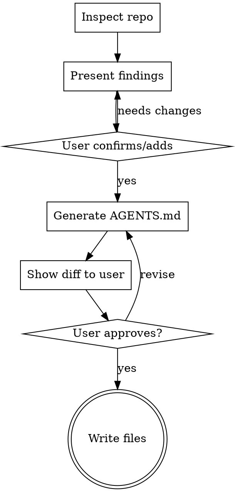

# Create AGENTS.md

Generate an AGENTS.md file that gives coding agents the non-obvious context they need to work effectively in a repository. Also creates a CLAUDE.md containing only `@AGENTS.md`.

**Core principle:** Write what is HARD for agents to find, not what's obvious. Agents already know how to use git, write code, and run standard tools.

## Workflow



## Step 1: Inspect the Repository

Run these inspections in parallel:

**Project identity and stack:**
- Read README.md for project description and context
- Read primary config: package.json, composer.json, Cargo.toml, go.mod, pyproject.toml, Gemfile, etc.
- Check for monorepo indicators: workspaces, lerna.json, nx.json, turbo.json, pnpm-workspace.yaml
- Note language versions: .nvmrc, .node-version, .tool-versions, .python-version, rust-toolchain.toml

**Directory structure:**
- `ls` the root directory
- Identify the top-level layout pattern (src/, lib/, packages/, apps/, etc.)
- For monorepos, list the packages/workspaces

**Build, lint, and test commands:**
- Read Makefile, package.json `scripts`, Taskfile.yml, justfile, composer.json `scripts`
- Read CI config: .github/workflows/*.yml, .circleci/config.yml, Jenkinsfile
- Identify: build command, lint command, test command (unit + integration), dev server command
- Note any required environment setup (Docker, .env files, database)

**Conventions:**
- `git log --oneline -20` for commit message style
- `git branch -a | head -20` for branch naming patterns
- Check for: .eslintrc*, .prettierrc*, phpcs.xml, .editorconfig, biome.json
- Check for: CONTRIBUTING.md, .github/PULL_REQUEST_TEMPLATE.md
- Check for existing: CLAUDE.md, AGENTS.md, .cursorrules, .github/copilot-instructions.md

**Architecture signals:**
- Read entry points (index.ts, main.go, app.py, etc.)
- Look for architecture docs in docs/ or ARCHITECTURE.md
- Identify patterns: MVC, hexagonal, event-driven, microservices, plugin-based

**Pitfall signals:**
- Check for generated files that should not be edited (look for "DO NOT EDIT" patterns)
- Check for vendored dependencies (vendor/, third_party/)
- Look at .gitignore for clues about generated artifacts
- Note any unusual build steps or prerequisites

## Step 2: Present Findings to User

Before generating, present a summary:

```
## Repo Inspection Results

**Project:** [name] - [one-line description]
**Stack:** [language] [version], [framework], [key deps]
**Structure:** [monorepo/standard] - [brief layout]

**Commands found:**
- Build: `[command]`
- Test: `[command]`
- Lint: `[command]`

**Conventions observed:**
- Commits: [style from git log]
- Branches: [pattern from git branch]

**Architecture:** [brief pattern]

**Things I couldn't determine:**
- [list unknowns]

Anything to add or correct before I generate AGENTS.md?
```

Use AskUserQuestion to confirm and gather any missing context the user wants included (common pitfalls, team conventions, architectural decisions).

## Step 3: Generate AGENTS.md

Use only sections that apply. Skip empty sections. Keep total under 500 lines.

### Template

```markdown
# [Project Name]

[One-line description of what this project is.]

## Tech Stack

- [Language] [version] — [framework/runtime]
- [Key dependency]: [what it's used for, if non-obvious]
- [Build tool]: [version if it matters]

## Directory Structure

[Only include non-obvious layout. Skip if it's a standard framework structure.]

```
[brief tree of important top-level dirs with one-line descriptions]
```

## Commands

### Build
```sh
[exact command]
```

### Test
```sh
[unit test command]
[integration test command, if different]
```
[Note: any prerequisites like running database, Docker, etc.]

### Lint
```sh
[lint command]
[autofix command if available]
```

### Dev
```sh
[dev server command]
```
[Note: ports, URLs, required env vars]

## Conventions

- **Commits:** [observed style, e.g., "Conventional Commits: type(scope): description"]
- **Branches:** [pattern, e.g., "feature/TICKET-123-short-description"]
- **PRs:** [any conventions — template, review requirements, CI checks]
- **Tests:** [when to write tests, what kind, coverage expectations]
- **Code style:** [enforced by linter — just mention the tool, don't repeat its rules]

## Architecture

[High-level decisions that deviate from defaults or that an agent might "fix" incorrectly.]

[Examples: "State management uses X instead of Y because...", "We use a custom router because...", "The plugin system uses dynamic imports intentionally — do not convert to static."]

## Common Pitfalls

- [Thing agents/developers commonly get wrong]
- [Files or patterns that MUST NOT be modified]
- [Non-obvious prerequisites or gotchas]
- [Environment-specific issues]
```

### Writing Quality Rules

- **Be explicit with commands** — copy-pasteable, not "run the test suite"
- **Use MUST/CRITICAL** for rules that cause real breakage if violated
- **Use "prefer" or "should"** for nice-to-haves
- **Don't restate what agents know** — no need to explain how git works, how to read JSON, etc.
- **Don't list every CLI flag** — basic usage and when to use each command is enough
- **Keep descriptions proportional** — 2 lines for simple sections, more for complex ones

## Step 4: Create CLAUDE.md

Generate a CLAUDE.md containing only:

```
@AGENTS.md
```

This keeps a single source of truth in AGENTS.md while ensuring Claude Code reads it.

## Step 5: Show Diffs and Get Approval

CRITICAL: Always show the full generated content as diffs before writing any files.

- If AGENTS.md already exists, show a diff against the existing file
- If CLAUDE.md already exists, warn the user and show what will change
- Ask for explicit approval before writing
- NEVER overwrite existing files without confirmation

## Common Mistakes

| Mistake | Fix |
|---------|-----|
| Including obvious info ("use git to commit") | Only write what's hard to discover |
| Letting the agent auto-generate everything | User must review — agents miss non-obvious context |
| Splitting into many sub-files too early | Keep one root file until it exceeds ~500 lines |
| Writing rules the linter already enforces | Reference the linter, don't duplicate its rules |
| Being vague about commands ("run tests") | Give exact copy-pasteable commands |
| Missing the Common Pitfalls section | This section prevents the most mistakes — always include it |
| Using symlinks for CLAUDE.md | Use `@AGENTS.md` content instead — symlinks break on Windows/sync |
